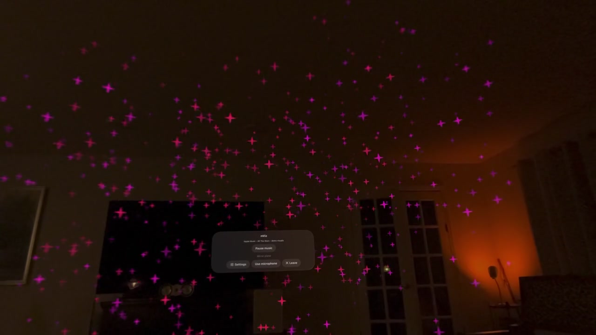

# mViz

A spatial audio visualizer for visionOS built with SwiftUI, RealityKit, and AVAudioEngine. Built for Apple Vision Pro with Xcode 16 / visionOS 2+ SDK.

https://github.com/user-attachments/assets/demo

<div align="center">
  <video src="Docs/media/mViz-demo.mp4" controls width="100%" poster="Docs/media/mViz-demo-poster.jpg"></video>
  <p><em>Apple Vision Pro spatial capture of mViz in passthrough mode, showcasing real-time audio reactivity, room surface illumination, and floating visionOS spatial controls.</em></p>
</div>

[](Docs/media/mViz-demo.mp4)

---

## Run on Vision Pro

1. Open `mViz.xcodeproj` in Xcode.
2. Select the `mViz` scheme and your paired **Apple Vision Pro** hardware (or visionOS Simulator).
3. Build & Run (`Cmd + R`).

Choose **Enter visualizer** on the main window. **Show surroundings** toggles live between passthrough and full immersion. The floating **Settings** ornament panel exposes movement modes, particle forms, speed, intensity, sensitivity, and room interaction. Tap **Leave** or use system immersion controls to exit.

---

## 12 Spatial Movement Modes

mViz features twelve distinct movement kinematics spanning a full 360° celestial sphere around the listener:

- **Cosmic fog:** A volumetric 3D particle mist cloud that envelops the listener in a living, breathing nebula of harmonic laminar flow, gentle tidal drift, wide particle spread, and subtle breathing luminescence.
- **Supernova:** A relativistic pulsar featuring energetic polar plasma jets erupting straight toward the ceiling ( pprox 3.5	ext{m}$) and floor ( pprox 0.3	ext{m}$), encircled by a high-velocity equatorial accretion disk with relativistic streak elongation and transient beat strobes.
- **Flurry spectrum:** Ten stationary spectrum columns five meters in front of the viewer, ordered from 31 Hz to 16 kHz to match the 10-band GEQ. Colored, wispy light trails curl upward from each column's audio-reactive tip, inspired by the classic macOS Flurry screensaver. Tap **Recenter** to reposition in front of your head orientation.
- **Nebula:** An orbiting spherical constellation of color with 3D inclined orbital planes that sweep directly above the user (zenith) and beneath the user (nadir) with oscillating rotational direction.
- **Double helix:** Braided vertical double-helix strands that spiral upward from directly below your feet, expand outward around you at eye level, and twist together directly above your head.
- **Aurora:** Draped celestial ribbons culminating in a luminous overhead crown / corona dancing directly above the user's head.
- **Vortex:** A 3D cyclone with spiraling height and radius changes, narrowing into a funnel tip directly below the user and spiraling into a vortex spout directly above.
- **Mirror line:** 12 emitters arranged symmetrically in a horizontal line in front of the user perspective, reacting with mirrored wave dynamics and paired colors. Tap **Center stage in front of me** to align the line with your current head orientation.
- **Mirror plane:** A 4×3 planar grid of emitters positioned in front of the user with symmetrical undulating wave motion and mirrored color coordination.
- **Rain:** Gentle downward precipitation distributed across the entire overhead sky disk—including directly above the user's head—with stretched particle trails, gravity simulation, and lateral drift.
- **Volcano:** Explosive upward eruption from caldera vents spanning the ground plane directly below the user with bass-reactive velocity and spread, warm fiery colors, and gravity pulling particles back down.
- **Room bounce:** A pool of up to 96 audio-reactive physics particles colliding with detected room surfaces, launched from emitters traversing ceiling to floor. Colors dynamically shift across the spectrum based on real-time audio frequency balance. Enabled by default; requires World Sensing permission. If surfaces are unavailable, ambient particles continue and the panel explains the state.

> **Spherical 360° Clearance:** All 360° modes maintain a 1.35m spherical clearance around the user at eye level:
> 66623	ext{minRadius} = \sqrt{\max(0, 1.35^2 - (y - 1.5)^2)}66623
> Emitters freely pass directly overhead (zenith) and underfoot (nadir) without ever clipping into your personal eye space.

---

## 10-Band ISO Graphic Equalizer (GEQ) & VU Meter

- **DSP Filter Bank (`BandAnalyzer.swift`):** Powered by a true 10-band ISO standard Graphic Equalizer running second-order constant-skirt-gain biquad bandpass IIR filters with zero algorithmic latency:
  - **ISO Center Frequencies:** `31.25 Hz`, `62.5 Hz`, `125 Hz`, `250 Hz`, `500 Hz`, `1 kHz`, `2 kHz`, `4 kHz`, `8 kHz`, `16 kHz`.
- **Spatial Emitter Mapping (`ParticleField.swift`):** Each of the 10 frequency bands is mapped directly to a dedicated spatial particle emitter (Emitters 0–9: sub-bass pulse, kick body, basslines, warmth, vocal clarity, attack bite, percussion presence, air shimmer) plus 2 macro dynamic emitters (Emitters 10–11).
- **10-Band Spectrum Analyzer (`VUMeterView.swift`):** Features an interactive vertical 10-band LED spectrum analyzer displayed above macro BASS/MID/HIGH level meters with peak indicators and signal status badges.

---

## Particle Styles & Shapes

- **Particle Styles:** Choose between **Glow** (soft radial bloom), **Sparks** (sharp directional bursts with fast decay), **Halo rings** (expanding rings), **Snowflakes** (intricate 6-point crystals with rotational noise), or **Evolving** (cycles automatically through styles every 12 seconds).
- **Emitter Shapes:** Choose between **Spheres**, **Rings** (torus), **Ribbons** (plane), **Cones**, **Cubes** (box), or **Evolving** (cycles through shapes every 8 seconds, contracting the emission surface before smoothly morphing).
- **Motion Speed:** Default `2.6×`. Adjustable slider spanning `0.25×` to `3.00×` controlling angular velocity, emitter displacement, and particle flight dynamics.

---

## Beat Lighting & Latency Compensation

- **Lighting Profiles:** **Evolving** (default — transitions automatically with particle modes, smoothly fading between pulse, strobe, and off phases), **Off** (forced off), **Pulse** (smooth exponential decay), or **Strobe** (crisp onset flash).
- **Mode-Driven Lighting Profiles:**
  - *Calm / Off Phase:* Nebula, Mirror plane, Rain.
  - *Smooth Pulse:* Double helix, Aurora, Cosmic fog, Room bounce.
  - *Dynamic Strobe:* Volcano, Vortex, Supernova, Mirror line.
  - Lighting intensities smoothly fade in and fade out according to continuous motion blend weights.
- **Surface & Celestial Illumination:** Synchronized flashes illuminate detected room surface meshes (in passthrough) or the surrounding celestial sphere (in full immersion) on bass beats.
- **Photosensitivity Safety:** Flashes are strictly rate-limited to a maximum of 2 Hz ($\ge 0.5\text{s}$ refractory cooldown). When system **Reduce Motion** is active, strobe automatically downgrades to a gentle pulse.
- **Audio Sync Delay:** Slider ranging from `0.00s` to `0.60s` (default `0.25s`) compensates for audio-to-visual rendering pipeline latency.

---

## Audio Sources & Continuous Playback

- **Apple Music Library:** Uses MusicKit (`MusicLibraryRequest<Song>`) to browse library tracks with real-time search. Initialized with continuous queue playback (`music.queue = .init(for: librarySongs, startingAt: song)`). Playback and autoplay continue seamlessly even when the browser sheet is dismissed. Features automatic track title monitoring and skip-to-next support.
- **Acoustic Microphone Tap:** When playing DRM-protected Apple Music, an acoustic microphone tap captures the speaker audio and feeds the 10-band GEQ filter bank with zero synthetic waveforms. Audio settles naturally to idle between tracks.
- **Imported Playlists:** Import DRM-free audio files via file picker. Songs are stored locally with persistent star ratings, favorites, and completed-play counts. Includes **Favorites Mix** shuffle.
- **Microphone Mode:** Choose **Start microphone** to visualize any external live audio from room speakers or instruments.

---

## Performance Architecture

- **VSYNC-Driven 90 FPS Render Loop:** Subscribes natively to RealityKit `SceneEvents.Update`, rendering at native headset refresh rate without timer stalls.
- **Lock-Free Band Storage:** Uses `os_unfair_lock` in `AudioBandStorage` for thread-safe cross-thread transfer between CoreAudio realtime threads and RealityKit frames.
- **Material Caching:** Room physics particles share pre-allocated `UnlitMaterial` buckets updated only on spectral shifts, eliminating per-frame allocations.
- **Pure SwiftUI Views:** Decoupled audio envelope reads from SwiftUI body evaluations, eliminating layout invalidation loops and launch hangs.

---

## Code Organization

- `mViz/Modes/`: 12 motion pattern definitions conforming to `MotionPattern` (`AuroraMode`, `CosmicFogMode`, `FlurrySpectrumMode`, `HelixMode`, `MirrorLineMode`, `MirrorPlaneMode`, `NebulaMode`, `RainMode`, `RoomBounceMode`, `SupernovaMode`, `VolcanoMode`, `VortexMode`).
- `mViz/Rendering/`: Core RealityKit rendering, `ParticleField`, `MotionBlend`, `ParticleAppearance`, `RoomEnvironment`, `RoomPhysics`, `BeatPulse`, and `AudioColor`.
- `mViz/Audio/`: 10-band `BandAnalyzer`, `LocalMusicPlayer`, `LocalTrack`, and `AppleMusicURLParser`.
- `mViz/Model/`: Observable app state (`VisualizerModel` and `QueuedTrack`).
- `mViz/Views/`: SwiftUI views for 10-band `VUMeterView`, `VisualizerControls`, `MusicBrowserView`, and `PlaylistView`.
- `Docs/media/`: Demo video recordings and poster assets.

---

## Verification & Automated Tests

Run the test suites locally from the repository root:

```bash
# 10-Band GEQ DSP and frequency response checks
sh Tests/run-audio-checks.sh

# 12 movement modes, eye clearance, boundary, and blend tests
sh Tests/run-visualizer-checks.sh

# Apple Music URL parsing and shared queue state checks
sh Tests/run-queue-checks.sh

# Production playback queue policy checks
sh Tests/run-playback-checks.sh
```

---

## Documentation

- [Apple Music Audio Access & Investigation](Docs/AppleMusicAudioAccess.md): Comprehensive findings on visionOS audio APIs and system tap constraints.
- [Private Audio Investigation](Docs/PrivateAudioInvestigation.md): Analysis of CoreAudio and ProcessAssertion tap possibilities.
